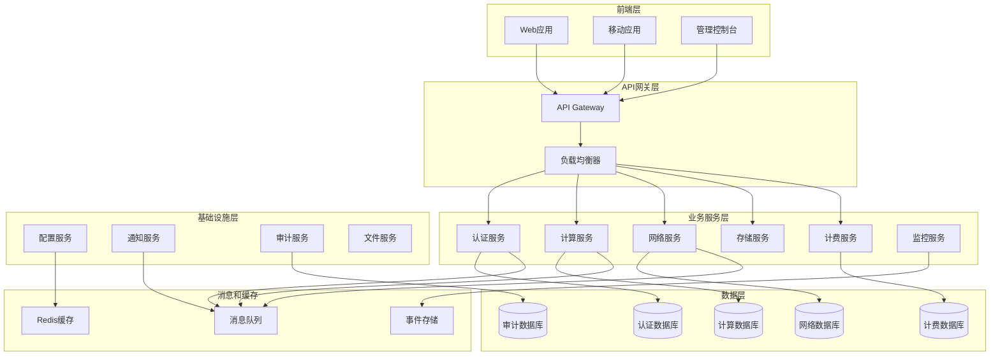

# Axnover平台详细拆分设计文档

## 概述

本设计文档详细描述了Axnover云计算平台的重构架构，将现有系统拆分为更细粒度的微服务架构，提高系统的可维护性、可扩展性和模块化程度。设计遵循领域驱动设计(DDD)原则，采用事件驱动架构和CQRS模式。

## 架构设计

### 整体架构图



### 服务拆分策略

#### 1. 核心业务服务

**认证授权服务 (Authentication & Authorization Service)**
- 用户管理
- 角色权限管理
- JWT令牌管理
- SSO集成 (Casdoor)
- 多因子认证

**计算服务 (Compute Service)**
- 虚拟机实例管理
- 容器服务管理
- 自动扩缩容
- 实例类型管理
- 资源调度

**网络服务 (Network Service)**
- VPC管理
- 负载均衡器
- 安全组管理
- 路由表管理
- 网络拓扑

**存储服务 (Storage Service)**
- 块存储管理
- 对象存储管理
- 文件系统管理
- 备份恢复
- 存储策略

**计费服务 (Billing Service)**
- 资源使用计量
- 价格计算
- 账单生成
- 支付集成
- 成本分析

#### 2. 基础设施服务

**配置管理服务 (Configuration Service)**
- 集中配置管理
- 动态配置更新
- 环境配置隔离
- 配置版本管理
- 配置审计

**监控服务 (Monitoring Service)**
- 指标收集
- 日志聚合
- 告警管理
- 性能分析
- 健康检查

**通知服务 (Notification Service)**
- 邮件通知
- 短信通知
- 站内消息
- Webhook通知
- 消息模板管理

**审计服务 (Audit Service)**
- 操作日志记录
- 安全事件追踪
- 合规性报告
- 数据变更追踪
- 访问日志分析

**文件服务 (File Service)**
- 文件上传下载
- 文件版本管理
- 文件权限控制
- 文件预览
- 文件同步

## 组件和接口设计

### 1. API网关设计

**功能特性:**
- 请求路由和负载均衡
- 认证和授权
- 限流和熔断
- API版本管理
- 请求/响应转换

**技术选型:**
- Kong或Traefik作为网关
- JWT认证中间件
- Redis作为限流存储
- Prometheus指标收集

### 2. 服务间通信设计

**同步通信:**
- gRPC用于内部服务通信
- REST API用于外部接口
- 服务发现使用Consul或etcd

**异步通信:**
- RabbitMQ或Apache Kafka作为消息队列
- 事件驱动架构
- 发布订阅模式

### 3. 前端架构设计

**微前端架构:**
```
frontend/
├── shell-app/              # 主应用壳
│   ├── src/
│   │   ├── layout/         # 布局组件
│   │   ├── routing/        # 路由管理
│   │   └── shared/         # 共享组件
├── auth-module/            # 认证模块
├── compute-module/         # 计算模块
├── network-module/         # 网络模块
├── billing-module/         # 计费模块
├── monitoring-module/      # 监控模块
└── shared-components/      # 共享组件库
    ├── ui-components/      # UI组件
    ├── utils/             # 工具函数
    └── types/             # 类型定义
```

**技术实现:**
- Module Federation (Webpack 5)
- 独立部署和版本管理
- 共享依赖优化
- 统一状态管理 (Zustand)

### 4. 数据库设计

**数据库拆分策略:**

**认证数据库 (PostgreSQL)**
```sql
-- 用户表
users (id, username, email, password_hash, created_at, updated_at)
-- 角色表
roles (id, name, description, permissions)
-- 用户角色关联表
user_roles (user_id, role_id)
```

**计算数据库 (PostgreSQL)**
```sql
-- 实例表
instances (id, name, type, status, user_id, vpc_id, created_at)
-- 实例类型表
instance_types (id, name, cpu, memory, disk, price_per_hour)
-- 实例操作日志表
instance_operations (id, instance_id, operation, status, timestamp)
```

**网络数据库 (PostgreSQL)**
```sql
-- VPC表
vpcs (id, name, cidr_block, user_id, created_at)
-- 子网表
subnets (id, vpc_id, cidr_block, availability_zone)
-- 安全组表
security_groups (id, name, vpc_id, rules)
```

**计费数据库 (PostgreSQL)**
```sql
-- 使用记录表
usage_records (id, user_id, resource_type, resource_id, usage_amount, timestamp)
-- 账单表
bills (id, user_id, billing_period, total_amount, status)
-- 价格表
pricing (id, resource_type, price_per_unit, currency)
```

**时序数据库 (InfluxDB)**
- 监控指标数据
- 性能数据
- 日志数据

## 数据模型

### 1. 领域模型设计

**用户聚合 (User Aggregate)**
```go
type User struct {
    ID       string
    Username string
    Email    string
    Profile  UserProfile
    Roles    []Role
}

type UserProfile struct {
    FirstName string
    LastName  string
    Avatar    string
    Timezone  string
}
```

**计算聚合 (Compute Aggregate)**
```go
type Instance struct {
    ID          string
    Name        string
    Type        InstanceType
    Status      InstanceStatus
    NetworkInfo NetworkInfo
    Owner       UserID
    CreatedAt   time.Time
}

type InstanceType struct {
    ID     string
    Name   string
    CPU    int
    Memory int64
    Disk   int64
}
```

**网络聚合 (Network Aggregate)**
```go
type VPC struct {
    ID        string
    Name      string
    CIDRBlock string
    Subnets   []Subnet
    Owner     UserID
}

type Subnet struct {
    ID               string
    CIDRBlock        string
    AvailabilityZone string
    RouteTable       RouteTableID
}
```

### 2. 事件模型设计

**领域事件:**
```go
type DomainEvent interface {
    EventID() string
    EventType() string
    AggregateID() string
    Timestamp() time.Time
}

type InstanceCreatedEvent struct {
    InstanceID   string
    UserID       string
    InstanceType string
    Timestamp    time.Time
}

type BillingEvent struct {
    UserID       string
    ResourceType string
    ResourceID   string
    Usage        float64
    Timestamp    time.Time
}
```

## 错误处理

### 1. 错误分类和处理策略

**业务错误:**
- 验证错误 (400 Bad Request)
- 权限错误 (403 Forbidden)
- 资源不存在 (404 Not Found)
- 业务规则冲突 (409 Conflict)

**系统错误:**
- 服务不可用 (503 Service Unavailable)
- 超时错误 (504 Gateway Timeout)
- 内部错误 (500 Internal Server Error)

**错误处理机制:**
```go
type APIError struct {
    Code    string `json:"code"`
    Message string `json:"message"`
    Details map[string]interface{} `json:"details,omitempty"`
}

type ErrorHandler interface {
    HandleError(ctx context.Context, err error) APIError
}
```

### 2. 重试和熔断机制

**重试策略:**
- 指数退避重试
- 最大重试次数限制
- 幂等性保证

**熔断器模式:**
- 失败率阈值监控
- 半开状态探测
- 快速失败机制

## 测试策略

### 1. 测试金字塔

**单元测试 (70%)**
- 业务逻辑测试
- 数据模型测试
- 工具函数测试
- 覆盖率要求: >80%

**集成测试 (20%)**
- API接口测试
- 数据库集成测试
- 消息队列集成测试
- 第三方服务集成测试

**端到端测试 (10%)**
- 用户场景测试
- 关键业务流程测试
- 性能测试
- 安全测试

### 2. 测试环境和工具

**测试框架:**
- Go: Testify + Ginkgo
- TypeScript: Jest + Testing Library
- API测试: Postman + Newman

**测试环境:**
- 单元测试: 内存数据库
- 集成测试: Docker容器
- E2E测试: Kubernetes集群

**持续集成:**
- GitHub Actions或GitLab CI
- 自动化测试执行
- 代码质量检查
- 安全扫描

### 3. 性能测试

**负载测试:**
- 并发用户数: 1000+
- 响应时间: <200ms (P95)
- 吞吐量: 10000 RPS

**压力测试:**
- 系统极限测试
- 资源瓶颈识别
- 故障恢复测试

**工具选择:**
- K6或JMeter进行负载测试
- Prometheus + Grafana监控
- Jaeger分布式追踪

## 部署和运维

### 1. 容器化部署

**Docker镜像构建:**
```dockerfile
# 多阶段构建
FROM golang:1.21-alpine AS builder
WORKDIR /app
COPY . .
RUN go build -o service ./cmd/service

FROM alpine:latest
RUN apk --no-cache add ca-certificates
WORKDIR /root/
COPY --from=builder /app/service .
CMD ["./service"]
```

**Kubernetes部署:**
```yaml
apiVersion: apps/v1
kind: Deployment
metadata:
  name: compute-service
spec:
  replicas: 3
  selector:
    matchLabels:
      app: compute-service
  template:
    metadata:
      labels:
        app: compute-service
    spec:
      containers:
      - name: compute-service
        image: axnover/compute-service:latest
        ports:
        - containerPort: 8080
        env:
        - name: DB_HOST
          valueFrom:
            secretKeyRef:
              name: db-secret
              key: host
```

### 2. 服务发现和配置管理

**服务注册:**
- Consul或etcd作为服务注册中心
- 健康检查和自动故障转移
- 服务元数据管理

**配置管理:**
- ConfigMap和Secret管理
- 动态配置更新
- 环境隔离

### 3. 监控和日志

**监控指标:**
- 业务指标: 用户数、实例数、收入等
- 技术指标: CPU、内存、网络、磁盘
- 应用指标: 响应时间、错误率、吞吐量

**日志管理:**
- 结构化日志 (JSON格式)
- 集中式日志收集 (ELK Stack)
- 日志分级和过滤
- 敏感信息脱敏

**告警策略:**
- 多级告警 (警告、严重、紧急)
- 告警聚合和去重
- 自动故障恢复
- 值班轮换机制

## 安全设计

### 1. 认证和授权

**多层认证:**
- JWT令牌认证
- API密钥认证
- OAuth 2.0集成
- 多因子认证 (MFA)

**细粒度授权:**
- 基于角色的访问控制 (RBAC)
- 基于属性的访问控制 (ABAC)
- 资源级权限控制
- 动态权限评估

### 2. 数据安全

**数据加密:**
- 传输加密 (TLS 1.3)
- 存储加密 (AES-256)
- 密钥管理 (HashiCorp Vault)
- 数据脱敏和匿名化

**数据备份:**
- 自动化备份策略
- 跨区域备份
- 备份数据加密
- 恢复测试验证

### 3. 网络安全

**网络隔离:**
- VPC网络隔离
- 安全组规则
- 网络ACL控制
- 微分段策略

**DDoS防护:**
- 流量清洗
- 限流策略
- 黑白名单
- 异常检测

## 迁移策略

### 1. 渐进式迁移

**阶段一: 基础设施准备**
- 容器化现有服务
- 建立CI/CD流水线
- 部署监控和日志系统

**阶段二: 服务拆分**
- 按业务域拆分服务
- 数据库拆分和迁移
- API网关部署

**阶段三: 前端重构**
- 微前端架构实施
- 组件库建设
- 渐进式功能迁移

**阶段四: 优化和完善**
- 性能优化
- 安全加固
- 功能完善

### 2. 数据迁移

**数据迁移策略:**
- 双写模式保证数据一致性
- 增量数据同步
- 数据校验和回滚机制
- 最小停机时间

**迁移工具:**
- 自定义数据迁移脚本
- 数据库同步工具
- 数据验证工具
- 回滚机制

这个设计文档提供了完整的架构重构方案，涵盖了从服务拆分到部署运维的各个方面，为项目的详细拆分提供了清晰的技术路线图。